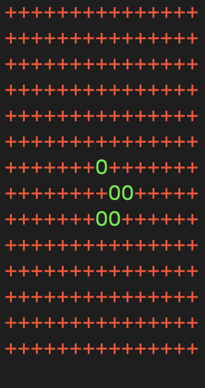

# game-of-life
## Conway's Game of Life

### About
The first version of app simulating the `Conway's Game of Life`. The Game of Life is a cellular automaton devised by the British mathematician John Horton Conway in 1970. It is a zero-player game, meaning that its evolution is determined by its initial state, requiring no further input. For more informations check https://en.wikipedia.org/wiki/Conway%27s_Game_of_Life

### Rules
- Any live cell with two or three live neighbours survives.
- Any dead cell with three live neighbours becomes a live cell.
- All other live cells die in the next generation. Similarly, all other dead cells stay dead.

### How to run the Game of Life
1) Run `pip3 install -r requirements.txt` to install dependencies
2) Run `./run.py --file <path-to-initial-configuration>` to play the game. `path-to-initial-configuration` contains the list of tuples (X and Y coordinates of cells). If the coordinates are in wrong format, or path to configuration file is broken, the default coordinates are used. For example:
```
[
    (0, 0),
    (0, 1),
    (1, 1),
    (3, 1),
    (0, 3),
    (1, 3),
    (2, 3),
    (3, 3),
    (2, 4)
]
```
The example file with initial cell coordinates can be found at `init_cells_example.txt` path.
3) Cells, which are alive are described as green `O` character. Cells, which are dead are described as red `+` sign. The board has infinite size and it's rendered to the standard output preserving the distance between the edge of the board and the outermost cell from previous iteration to see the motion.

### Example
The classic example of the Spaceship - Glider - as a gif

